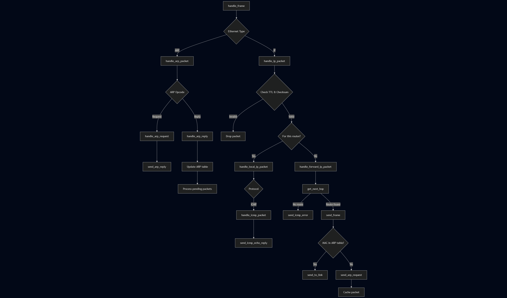

# Tema 1 - Dataplane Router 
<!-- Guiman Albert 325CA -->

Aceasta implementare abordeaza toate subcerintele din tema.

## Descrierea implementarii

### router.hpp / router.cpp
Contine implementarea in sine a routerului, interfata constand intr-o metoda care updateaza tabelul de rutare (`add_rtable_entries`) si o metoda care primeste un cadru (`handle_frame`).

Metoda `handle_frame` verifica tipul informatiei incapulate de cadru (IP/ARP) si il trimite mai departe catre metodele ce se ocupa cu gestionarea fiecarui tip de pachet (`handle_arp_packet`, `handle_ip_packet`).

Mai departe functiile folosite comportamentul indicat in cerinta temei, procesul de gestionare al cadrelor fiind unul cat se poate de liniar, fara revenire in functia apelanta. Din acest motiv, urmarirea fluxului programului este relativ accesibila, iar faptul ca nu se revine in functia apelanta da posibilitatea optimizarilor precum "tail-recursion".

De mentionat este si faptul ca nu am realizat verificari in plus fata de cele cerute in tema, precum verificari ce tin de securitate (ex: verificari de tipul "IP spoofing", sau verificari ale lungimii pachetelor). Astfel, programul functioneaza corect atat timp cat pachetele primite nu au erori sau intentii malitioase.

### binary_trie.hpp
Contine implementarea structurii de trie, avand drept chei valori intregi. Structura este generica peste orice cheie de tip intreg fara semn, prin mecanismul de templating.

### routing-table.hpp / routing-table.cpp

Acesta este doar un wrapper peste `BinaryTrie` pentru a decupla implementarea tabelului de rutare de logica routerului.

### arp-table.hpp / arp-table.cpp

Contine implementarea tabelului arp, care consta intr-un hashmap ce retine asocierea dintre o adresa IP cu o adresa MAC. De asemenea, acest tabel arp contine si un cache pentru pachetele care nu pot fi transmise momentan din lipsa unei asocieri IP-MAC. Pentru a utiliza acest cache, trebuie invocate manual metodele `add_pending_packet` si `retrieve_pending_packets`.

### util.hpp

Contine functii de utilitate generala, precum o templetizare a functiilor de conversie intre host order si network order, care simplifica mult codul prin evitarea apelarii de functii specializate precum `ntohl` sau `ntohs` in fiecare loc in care este necesara conversia. Functia `countl_one` ajuta la identificarea lungimii mastii de retea, care astfel devine lungimea prefixului folosit in trie.

### logger.hpp / logger.cpp

Pentru logare, am ales sa folosesc [spdlog](https://github.com/gabime/spdlog), o biblioteca open source foarte populara si usor de folosit. Logurile sunt afisate atat in consola, cat si intr-un fisier `log.txt`, majoritatea logurilor fiind dezactivate atunci cand programul e compilat fara flagul `DEBUG`.

Cu toate acestea, am fost nevoit sa dezactivez logurile pentru varianta evaluata pe moodle, deoarece arhiva ar fi depasit limita de 50KB.

### Biblioteci externe

In cadrul implementarii temei, pentru a moderniza si simplifica codul am ales sa folosesc **std::span** din C++20 in loc de pointeri raw. Totusi, din cauza faptului ca sistemul pe care va fi evaluata tema dispune de o versiune veche a compilatorului gcc si a bibliotecilor standard, a trebuit sa recurg la un workaround, anume folosirea unui [port](https://github.com/tcbrindle/span) al lui **std::span** pe C++17.

## Fluxul programului

